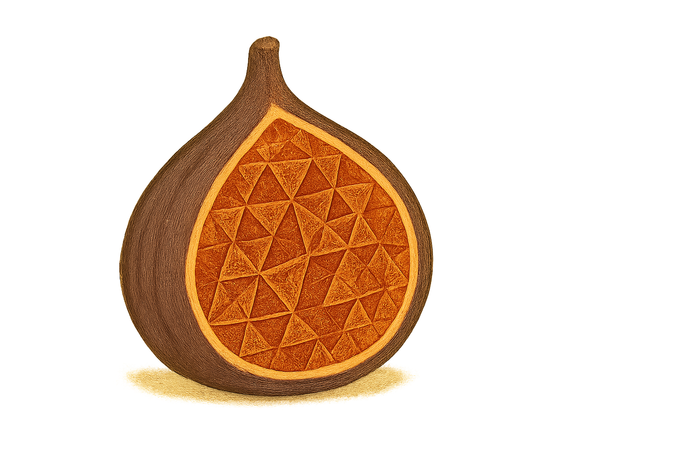

# FiGS: Flying in Gaussian Splats



FiGS is a framework for trajectory optimization and control in Gaussian Splatting environments.

## Installation

### Quick Start
```bash
git clone -b acados-away https://github.com/StanfordMSL/FiGS-Standalone.git
```

1) Update Submodules
```bash
cd FiGS-Standalone
git submodule update --recursive --init
```

2) Run the install.sh
```bash
bash install.sh
```

### What's Included
- Python 3.10 with numpy 1.26.4
- PyTorch 2.1.2 with CUDA support
- All core dependencies (nerfstudio, gsplat, etc.)
- FiGS package in editable mode

### Usage Examples
0) Where to store data
Drop your videos into 3dgs/captures. Drop your images into 3dgs/workspace.
Update capture_examples variable in notebooks/figs_3dgs_oneliner.py with the video or image directory names.

1) nerfstudio defaults
```bash
cd 3dgs/captures
ns-process-data video --data <data-directory-name> --output-dir ../workspace 

cd 3dgs/workspace
ns-train splatfacto --data <data-directory-name> \
--pipeline.model.camera-optimizer.mode SO3xR3 \
--pipeline.model.rasterize-mode antialiased

ns-export gaussian-splat --load-config <outputs/data-directory-name/splatfacto/YYYY-YY-YY-YYYYYY/config.yml> \
--ouput-dir <outputs/data-directory-name/splatfacto/YYYY-YY-YY-YYYYYY/exports>
```

2) FiGS notebooks
To process (colmap, 3dgs, export) all videos in capture_examples:
```bash
cd 3dgs/notebooks
conda activate FiGS
python figs_3dgs_oneliner.py
```

```bash
cd notebooks
python figs_3dgs.py

python figs_capture_calibration.py
```

### Known Issues (and some fixes)